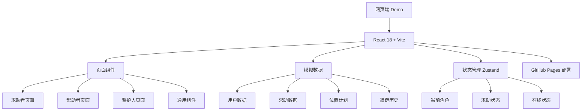

# 互助SOS Demo - 技术架构文档

## 1. 架构设计



## 2. 技术选型
- 前端：React 18 + TypeScript + Vite
- 样式：Tailwind CSS
- 状态管理：Zustand
- 图标：lucide-react
- 部署：GitHub Pages（gh-pages 分支）

## 3. 路由定义
| 路径 | 说明 |
|------|------|
| / | Demo主页（手机框架+角色切换） |
| 内部状态驱动 | 通过角色状态切换不同页面，不使用URL路由 |

## 4. 数据模型

### 4.1 用户数据
```typescript
interface User {
  id: string;
  phone: string;
  nickname: string;
  role: 'seeker' | 'helper' | 'guardian';
  disabilityType?: string;
  disabilityDetail?: string;
  emergencyContactName?: string;
  emergencyContactPhone?: string;
}
```

### 4.2 求助请求
```typescript
interface HelpRequest {
  id: string;
  seekerId: string;
  seekerNickname: string;
  latitude: number;
  longitude: number;
  reason: string;
  disabilityType?: string;
  disabilityDetail?: string;
  status: 'pending' | 'accepted' | 'cancelled' | 'resolved';
  distance?: number;
  createdAt: string;
  acceptedBy?: string;
}
```

### 4.3 位置计划
```typescript
interface LocationSchedule {
  id: string;
  name: string;
  dayOfWeek: number;
  startTime: string;
  endTime: string;
  latitude: number;
  longitude: number;
  address: string;
  enabled: boolean;
}
```

## 5. 项目结构
```
demo/
├── src/
│   ├── components/     # 通用组件
│   ├── pages/          # 页面组件
│   │   ├── seeker/     # 求助者页面
│   │   ├── helper/     # 帮助者页面
│   │   └── guardian/   # 监护人页面
│   ├── store/          # Zustand状态管理
│   ├── data/           # 模拟数据
│   └── utils/          # 工具函数
├── package.json
└── vite.config.ts
```

## 6. 部署方案
- 构建命令：`npm run build`
- 输出目录：`dist`
- GitHub Pages base路径：`/helpold/`
- 使用 `gh-pages` npm包自动部署到 gh-pages 分支
